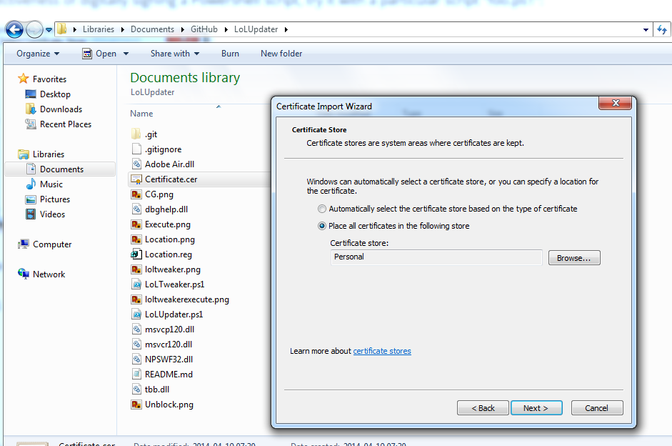
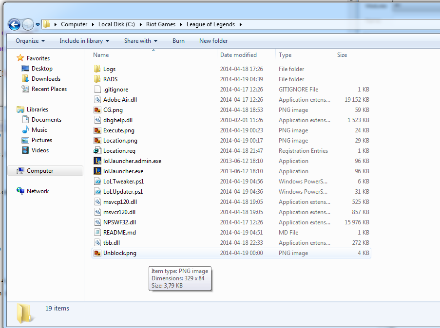
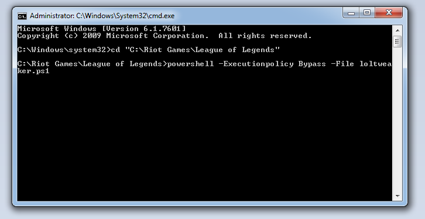

"RemoteSigned" should be replaced by "Unrestricted" for the time being
When you are done, set it to "Restricted"

[Download](https://github.com/Loggan08/LoLUpdater/archive/master.zip)
==========

Installation of Sample script (LoLTweaker.ps1)
============

[Download this first](http://developer.download.nvidia.com/cg/Cg_3.1/Cg-3.1_April2012_Setup.exe)

LoLTweaker
==============

LoLUpdater (SDK)
==========

