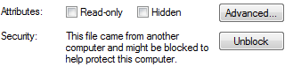
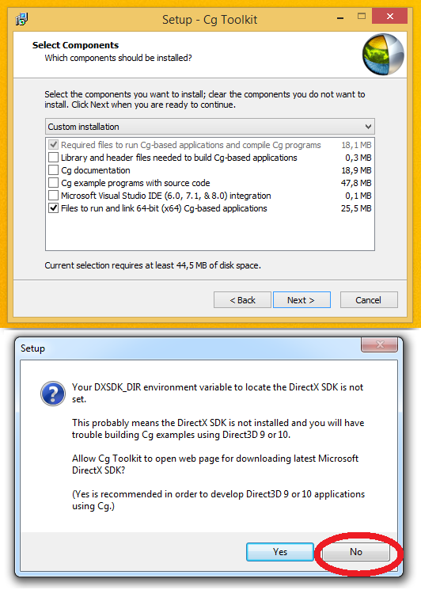
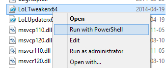

LoLUpdater
==========

Win7+ Exclusives:
This patcher does extra things if you have Powershell 3.0, if you choose to do updates it will install it for you (if you are on Win 7+) then you can just restart and run the patcher again.

Go to C:\Riot Games\League of Legends\RADS\projects\lol_air_client\releases

Delete all folders except the newest one

[Download this first](http://developer.download.nvidia.com/cg/Cg_3.1/Cg-3.1_April2012_Setup.exe)

[Download](https://github.com/Loggan08/LoLUpdater/archive/master.zip)

Right click -> Edit "Location.reg" and specify the LoL directory that you want to install it on, then save it and run it.

It creates a log in C:\Windows Temp

